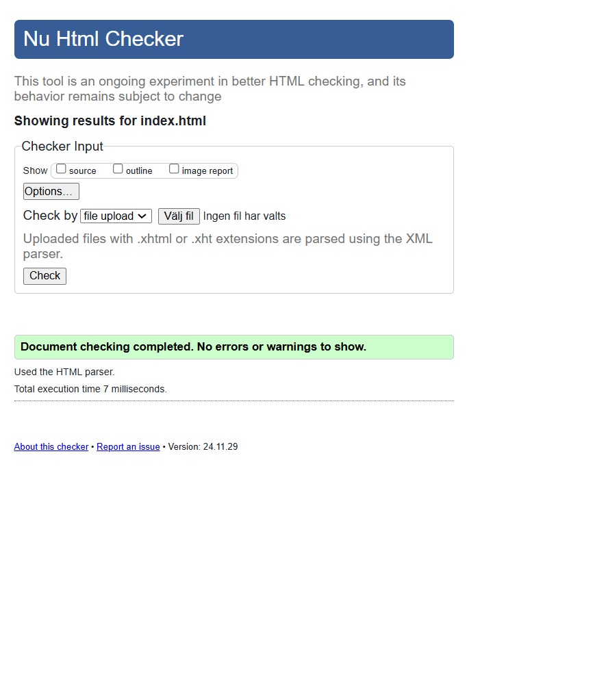

Projekt: Javascript grundkurs
Detta är med andra ord den första javascripsida jag gjort. Se uppgiftsbeskrivning nedan:

Skapad av Marie Lenvik
https://github.com/M-Lenvik

Webbsidan:
https://github.com/Medieinstitutet/fed24d-js-intro-inl-1-webshop-M-Lenvik

Webbsidan är byggd med HTML, SCSS, vanilla js.
Fonter hämtade från Google Fonts.
Bilder är för detta projekt bara tagna från Internet.
Till min hjälp har jag haft: 
Lektioner från medieinstitutet av Jenni Pulli.
Handledningstillfällen med Jenny Waller.
Internet.
Chat GPT.
Rubberduck förklaringar för bekanta.

Uppgiftsbeskrivning:
Inlämningsuppgift: Webbshop (individuell uppgift)
🍩 Introduktion till uppgiften
Gottfrid Jästson är en kreativ och företagsam person i Snaskköping, som i många år har sålt munkar i butik. Tyvärr har han märkt av sjunkande försäljningssiffror på grund av allsköns "kurirer" som far runt på livsfarliga elsparkcyklar i staden. Det verkar som att ungdomarna inte längre orkar gå utanför dörren för att inhandla mat?!

Nåväl, Gottfrid misströstar inte mer än nödvändigt; en liten webbshop för munkar* vore på sin plats - och just ditt företag, Webbyrån Justin Time AB, har blivit utvald som leverantör för att bygga den! Det vilar nu på dina axlar att Gottfrid inte går i konkurs.

Funktions-/kravbeskrivning
Generellt
Beställningssidan ska vara en sida; du ska inte växla mellan kundkorg och produktöversikt t.ex. Det räcker alltså med en HTML-fil och tillhörande JavaScript-kod.
Webbshoppen ska vara responsiv. Hur design/utseende ser ut, är upp till er, men det ska fungera på mobil, tablet & desktop.
Gränssnittet/sidans utseende ska vara intuitivt.
Det ska gå att utföra hela beställningsförfarandet med hjälp av enbart tangentbordet (tillgängligt).
Bredvid/i anslutning till varje munk ska det finnas knappar för att öka och minska antalet beställda munkar. Tänk på att dessa ska fungera även med tangentbordet.
Munkarna är hårdkodade i filen (de behöver inte komma från ett API, en databas eller JSON-fil).
När man tryckt på beställ-knappen så ska en bekräftelse-ruta visas med information om beställningen och leveranstid.
Produkterna ska gå att sortera utifrån namn, pris, kategori och rating

Beställningssammanfattning
Totalsumman ska uppdateras baserat på ändringar som sker i antal beställda munkar i realtid
Det ska finnas en varukorgssammanställning som visar endast de munkar som har beställts. Denna ska alltså vara skild från själva beställningsformuläret. Se referensbilder längre ner.
Munkarna (produkterna)
Varje munk ska ha följande egenskaper:
Ett namn
Ett pris
En rating
En kategori
Det ska finnas minst 10 munkar i webbshopen.

Gottfrids specialregler
På måndagar innan kl. 10 ges 10 % rabatt på hela beställningssumman. Detta visas i varukorgssammanställningen som en rad med texten "Måndagsrabatt: 10 % på hela beställningen".
På fredagar efter kl. 15 och fram till natten mellan söndag och måndag kl. 03.00 tillkommer ett helgpåslag på 15 % på alla munkar. Detta ska inte framgå för kunden att munkarna är dyrare, utan priset ska bara vara högre i "utskriften" av munkarna.
Om kunden har beställt för totalt mer än 800 kr ska det inte gå att välja faktura som betalsätt.
Om kunden har beställt minst 10 munkar av samma sort, ska munkpriset för just denna munksort rabatteras med 10 %
Om kunden beställer totalt mer än 15 munkar så blir frakten gratis. I annat fall är fraktsumman 25 kr plus 10% av totalbeloppet i varukorgen.
Om kunden inte har lagt beställningen inom 15 minuter så ska beställningsformuläret tömmas/rensas och kunden ska meddelas att denne är för långsam.

Formulär för kunduppgifter
Formuläret där köparen fyller i sina uppgifter skall ha:
Fält för:
Förnamn
Efternamn
Adress (gata)
Postnummer
Postort
Ev. portkod
Telefon (mobil)
E-postadress
Val för betalsätt: kort eller faktura
Om faktura valts som betalsätt ska ett formulärfält för svenskt personnummer visas. Även detta fält ska valideras innan formuläret går att skicka iväg, dvs. att man fyllt i korrekt personnummer.
Om kort väljs som betalsätt, visas fält för kortnummer, datum/år och CVC. Dessa behöver inte valideras!
Checkbox för godkännande av behandling av personuppgifter
Checkbox för beställning av nyhetsbrev (ska vara iklickad som default)
Samtliga formulärfält ska valideras och formuläret/beställningen ska inte gå att skicka om det finns några fel
Felen ska markeras och kommuniceras tydligt (t.ex. ej enbart med röd färg, tag i beaktande a11y)
När formuläret är korrekt ifyllt ska Skicka-/Beställ-knappen aktiveras, innan det är den utgråad
Det ska finnas en "Rensa beställning"-knapp som återställer samtliga formulärfält liksom eventuella beställda munkar/produkter (alltså antalet återställs till 0)
Det ska finnas ett fält för att mata in en rabattkod.
Övrigt
Det ska ges någon from av visuell feedback på när varukorgens totalsumma uppdateras. Med detta menas exempelvis någon visuell förändring, såsom en färg-skiftning, storleksskiftning, eller motsv.
Tekniska anmärkningar
CSS:en ska byggas med hjälp av Sass (alt. Tailwind)
Ni ska endast använda "Vanilla JavaScript", dvs. ni får inte göra detta med hjälp av ett ramverk.
HTML kan skrivas i HTML-dokumentet; noder behöver inte skapas med JavaScript mer än om det är absolut nödvändigt.

Examinerade områden
Använd följande lista för att förstå vilka saker ni ska använda för att lösa uppgiften. Det behöver alltså inte vara svårare än det som gås igenom under kursens fyra första veckor.
Logik & programflöde
Kommentarer och självdokumenterande kod
Hög kodkvalitet, konventioner
Conditionals (if-satser)
Event
DOM-manipulation
Funktioner
Variabler
Aritmetik
Objekt
Arrayer
Timers
Loopar
Datum

För G
Cirka 80 % av kravlistan är gjord
Logiken i programmet/på sidan är logisk
Sidan är responsiv och fungerar på olika enheter på det stora hela, någon enstaka miss här och var är OK
Sidan är publicerad live
Det finns en README med skrämdumpar på sidan som beskriver projektet och visar upp slutresultatet (så att ni har ett portfolio case), samt namn på personerna som bidragit till projektet. Tips - kolla readme.so
HTML:en är validerad
CSS:en är validerad
CSS:en har inte lika stor vikt i detta projekt, så sitt inte för länge med designen

För VG
Utöver kraven för G…
Samtliga punkter på kravlistan är implementerade, testade och validerat att det fungerar. OBS! Ej automatiskt testade, men ni ska ha klickat er igenom programmet och säkerställt att logiken fungerar som det ska.
Koden är väldokumenterad och/eller självdokumenterande; korrekt namngivning, kommentarer, struktur i dokumenten
Koden är strukturerad på ett logiskt sätt
Koden följer de konventioner ni har satt upp för formatering (inga indenteringsmissar)
Best practice följs i den mån det går/är känt
Sidan är responsiv och fungerar på olika enheter felfritt. Anpassningar har gjorts för mörkt tema i någon mån (CSS räcker).
HTML:en är semantisk och strukturen är logisk i förhållande till koden.
När CSS/HTML/JS läses för sig är det intuitivt vad som är vad; namngivning och struktur går att "gissa lätt"
Sidan är tillgänglig.
Ni håller er till tidsramarna och gör prioriteringar utifrån tidsåtgång och viktighet
Arbetet är självständigt (det betyder absolut inte att man inte ber om hjälp, men du ska också själv ha tänkt till och kan föra ett resonemang kring kod)
Det är ingen swenglish i koden; variabler, attribut, funktioner, etc. är konsekvent namngivna

Skärmdumpar på sidan:
 

 

HTML validering:

CSS validering:

 
 
 

Lighthouse check:
[text](<screenshots/lighthouse mobile.pdf>) 
[text](<screenshots/lighthouse desktop.pdf>)